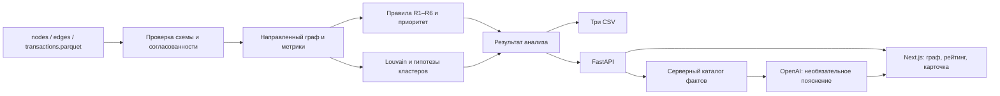

# Граф денег — CR7 Mentality

MVP команды **CR7 Mentality** для кейса **Freedom Bank / HackAlem AI**: восстановление структуры финансовой сети по обезличенным переводам. Сервис помогает AML-аналитику ответить: **кого проверить первым и какие наблюдаемые признаки объясняют этот приоритет**.

Основной расчёт воспроизводится локально без API-ключа, GPU, базы данных и платных сервисов. OpenAI используется отдельно для пояснения рассчитанных фактов. Все выводы — гипотезы для ручной проверки, а не утверждения о виновности.

## Что реализовано

- Пайплайн из трёх Parquet-файлов до метрик, ролей, кластеров, рейтинга и трёх CSV.
- Направленный граф с окраской ролей/кластеров, поиском по `gid` и карточкой клиента.
- Приоритеты с объяснениями, статистика сети и график наблюдаемого оборота по дням.
- Учёт обрыва на четвёртом колене, неполных входящих seed и изолированных клиентов.
- ИИ-пояснение выбранного клиента со ссылками на серверные факты и работа без ИИ при его недоступности.
- Интерфейс на русском, казахском и английском. Рассчитанные текстовые факты и ответы ИИ — на русском.

| Результат на предоставленном датасете | Значение |
|---|---:|
| Клиенты | 2 248 |
| Направленные агрегированные рёбра | 3 119 |
| Транзакции | 4 840 |
| Исходные клиенты, seed | 81 |
| Кластеры Louvain | 86 |
| Слабосвязные компоненты | 35: 16 с рёбрами и 19 изолированных узлов |
| Строки `top_nodes.csv` | 100 |
| Сумма транзакций | 365 890 012,01 KZT |

Это результаты расчёта, а не зашитые ответы. Числа кластеров, ролей и приоритетов пересчитываются из данных. В ТЗ оборот округлён до целого KZT.

## Стек и структура

Backend: Python 3.12, FastAPI, Pydantic, pandas, PyArrow, NetworkX, OpenAI SDK. Frontend: Next.js / React, TypeScript, Tailwind CSS, Cytoscape, Recharts. Версии Python-зависимостей закреплены в requirements, frontend — в `package-lock.json`. Для frontend используйте Node.js 24 и npm.

```text
backend/
  app/              # импорт, метрики, правила, кластеры, API и адаптер ИИ
  data/             # nodes.parquet, edges.parquet, transactions.parquet
  artifacts/        # три обязательные CSV-выгрузки
  scripts/          # HTTP smoke-проверка
  tests/            # проверки пайплайна, API и адаптера ИИ
  .env.example
  .python-version
  requirements.txt
  requirements-dev.txt
  railway.json
frontend/
  src/              # страницы, граф, карточки, рейтинг, ассистент
  tests/
  .env.example
  package.json
  package-lock.json
  railway.json
docs/
  RAILWAY.md
  PROJECT_PASSPORT.md
  api-contract.schema.json
  api-examples.json
  ai-answer.schema.json
  architecture.mmd
```



## Локальный запуск с чистого клона

Нужны Git, Python **3.12**, Node.js **24** с npm. Для установки зависимостей нужен интернет; после установки основной расчёт и сайт работают локально. Интернет при работе требуется только для включённого OpenAI. Если репозиторий закрыт, заранее авторизуйтесь в GitHub и получите доступ.

```bash
git clone https://github.com/BAITC-Hacks/hack-84eefdc9-cr7-mentality.git
cd hack-84eefdc9-cr7-mentality
```

Используйте два терминала: один для API, другой для frontend. Команды ниже не требуют активации виртуального окружения.

### 1. Backend — Windows PowerShell

Из корня клона:

```powershell
cd backend
py -3.12 -m venv .venv
.\.venv\Scripts\python.exe -m pip install -r requirements.txt
if (-not (Test-Path .env)) { Copy-Item .env.example .env }
.\.venv\Scripts\python.exe -m app.pipeline --data-dir data --out-dir artifacts --seed 42
.\.venv\Scripts\python.exe -m uvicorn app.main:app --host 127.0.0.1 --port 8000
```

### 1. Backend — Linux / macOS

Из корня клона:

```bash
cd backend
python3.12 -m venv .venv
.venv/bin/python -m pip install -r requirements.txt
test -f .env || cp .env.example .env
.venv/bin/python -m app.pipeline --data-dir data --out-dir artifacts --seed 42
.venv/bin/python -m uvicorn app.main:app --host 127.0.0.1 --port 8000
```

API: [http://localhost:8000](http://localhost:8000). Swagger со схемами и интерактивными запросами: [http://localhost:8000/docs](http://localhost:8000/docs). Готовность: [http://localhost:8000/healthz](http://localhost:8000/healthz).

Если на Windows нет команды `py`, создайте окружение через `python -m venv .venv`, предварительно проверив `python --version` (нужна 3.12).

API сам рассчитывает результат при запуске. Отдельная команда `app.pipeline` нужна для воспроизводимого запуска от сырых файлов до выгрузок без веб-сервера; для обычного запуска сайта её можно пропустить. После установки зависимостей это **одна команда**, которая создаёт все три CSV без ключа и обращения к OpenAI. Она выводит `analysis_id`, `runtime_ms`, размеры графа и пути результатов. Лимит кейса — 300 000 мс; измеряйте время на машине проверки, включая первый запуск процесса.

### 2. Frontend — второй терминал

Из корня клона:

```bash
cd frontend
npm ci
```

Создайте `frontend/.env.local` по `frontend/.env.example`. Для первого запуска:

```dotenv
NEXT_PUBLIC_API_BASE_URL=http://localhost:8000
NEXT_PUBLIC_ENABLE_DEMO=false
```

Запустите:

```bash
npm run dev
```

Откройте **[http://localhost:3000](http://localhost:3000)** → «Начать анализ» → «Запустить анализ». Для этих команд backend должен продолжать работать в первом терминале. Локальный адрес frontend должен точно совпадать с одним из `CORS_ORIGINS`.

### 3. Проверка production-сборки локально

Остановите frontend командой `Ctrl+C`, оставьте backend работающим:

```bash
cd frontend
npm run build
npm run start -- --hostname 127.0.0.1 --port 3000
```

Если терминал уже находится в `frontend`, повторный `cd frontend` не нужен. Production-сервер и dev-сервер не должны одновременно занимать порт 3000.

`NEXT_PUBLIC_API_BASE_URL` включается в клиентский JavaScript **при сборке**. После изменения этой переменной снова выполните `npm run build` и перезапустите frontend.

## Конфигурация

### Backend

Локальный файл — `backend/.env`. Он автоматически читается при запуске API, независимо от текущего каталога. **Переменные процесса имеют приоритет**: используется `load_dotenv(..., override=False)`. Поэтому старое `LLM_ENABLED=false` в окружении терминала перекроет `true` в файле. После изменения настроек перезапустите backend.

| Переменная | Значение / пример | Назначение |
|---|---|---|
| `LLM_ENABLED` | `false` | `true` включает обращения к OpenAI; без него основной анализ и CSV работают |
| `OPENAI_API_KEY` | пусто | Настоящий API-ключ проекта OpenAI; нужен только для ИИ |
| `OPENAI_MODEL` | `gpt-6-luna` в шаблоне | Модель, доступная вашему API-проекту и поддерживающая используемые структурированные ответы |
| `CORS_ORIGINS` | `["http://localhost:3000"]` | Разрешённые origins frontend; JSON-массив либо строка адресов через запятую |
| `DATA_DIR` | по умолчанию `backend/data` | Каталог трёх входных Parquet для API |
| `ARTIFACTS_DIR` | по умолчанию `backend/artifacts` | Каталог CSV, должен быть доступен для записи |
| `LLM_REQUESTS_PER_MINUTE` | `20` | Общий лимит попыток платных API-вызовов в минуту на процесс backend |
| `LLM_MAX_CONCURRENT` | `2` | Максимум одновременных платных API-вызовов на процесс |

Пример для локального ИИ:

```dotenv
LLM_ENABLED=true
OPENAI_API_KEY=YOUR_REAL_OPENAI_API_KEY
OPENAI_MODEL=gpt-6-luna
CORS_ORIGINS=["http://localhost:3000"]
LLM_REQUESTS_PER_MINUTE=20
LLM_MAX_CONCURRENT=2
```

`OPENAI_API_KEY` хранится **только на backend**. Не помещайте ключ в `NEXT_PUBLIC_*`, frontend, исходный код или Git. Код активации выданных кредитов не является API-ключом. `backend/.env` исключён из Git; в Railway значения задаются отдельно через Variables.

`DATA_DIR` и `ARTIFACTS_DIR` управляют API. Для CLI используйте параметры `--data-dir` и `--out-dir`. Относительные пути переменных разрешаются от рабочего каталога процесса; для нестандартных локальных расположений удобнее абсолютные пути. API рассчитан на один фиксированный батч июля 2026 года с данным контрактом.

Лимиты ИИ принимают положительные целые значения. Они общие для всех посетителей одного процесса. При исчерпании лимита сервис возвращает факты в fallback-режиме с объяснением недоступности; расчёт и CSV продолжают работать. Это ограничение частоты и параллелизма, **не денежный бюджет**. Для публичного MVP используйте **один worker и одну replica**; при масштабировании нужен общий внешний limiter.

### Frontend

| Переменная | Локальное значение | Railway |
|---|---|---|
| `NEXT_PUBLIC_API_BASE_URL` | `http://localhost:8000` | Публичный HTTPS URL backend, например `https://your-backend.up.railway.app` |
| `NEXT_PUBLIC_ENABLE_DEMO` | `false` | `false`; демонстрационные фикстуры в production не используются |
| `RAILPACK_NODE_VERSION` | не нужна локально | `24`, переменная сборки Railway |

В `NEXT_PUBLIC_API_BASE_URL` указывайте только базовый URL **без `/api/v1`**. Запросы выполняет браузер посетителя, поэтому `railway.internal` для этой переменной не подходит. Значение задаётся **до сборки frontend**.

`http://localhost:3000` и `http://127.0.0.1:3000` — разные origins. При необходимости разрешите оба:

```dotenv
CORS_ORIGINS=["http://localhost:3000","http://127.0.0.1:3000"]
```

CORS управляет браузерным доступом; он не заменяет авторизацию.

## Проверки перед сдачей

Результаты финального локального прогона и границы проверки: [docs/FINAL_CHECK.md](docs/FINAL_CHECK.md).

### Backend

Из `backend`, Windows:

```powershell
.\.venv\Scripts\python.exe -m pip install -r requirements-dev.txt
.\.venv\Scripts\python.exe -m pytest -q
```

Linux / macOS:

```bash
.venv/bin/python -m pip install -r requirements-dev.txt
.venv/bin/python -m pytest -q
```

Тесты проверяют полноту узлов, обязательные роли/поля, воспроизводимость CSV, обработку четвёртого колена и изолированных seed, API и адаптер ИИ. Для тестов не нужен настоящий ключ: внешние вызовы отключены или подменены.

### Frontend

Из `frontend`:

```bash
npm test
npm run lint
npm run build
npm run typecheck
```

На чистом клоне выполняйте **build перед typecheck**: Next.js при сборке создаёт используемые TypeScript-типы маршрутов.

### Сквозной HTTP-сценарий

При работающих сервисах, из корня репозитория:

```powershell
.\backend\.venv\Scripts\python.exe backend/scripts/smoke_api.py --base-url http://localhost:8000 --origin http://localhost:3000
```

Linux / macOS:

```bash
backend/.venv/bin/python backend/scripts/smoke_api.py --base-url http://localhost:8000 --origin http://localhost:3000
```

Скрипт проверяет готовность API → анализ → дашборд → выбранный узел и рёбра → ассистента → все CSV, а также CORS GET и preflight. По умолчанию корректный fallback ассистента допустим и явно показывается в выводе.

Чтобы проверить **именно настоящий ответ OpenAI**, сначала настройте ключ и `LLM_ENABLED=true`, затем добавьте флаг:

```powershell
.\backend\.venv\Scripts\python.exe backend/scripts/smoke_api.py --base-url http://localhost:8000 --origin http://localhost:3000 --require-live-ai
```

Этот запуск обращается к платному API и завершается ошибкой, если ассистент вернулся в fallback. Для проверки названного жюри клиента добавьте `--gid <gid>`. Для Railway замените оба адреса на публичные HTTPS-домены.

## Данные и выгрузки

Все три входных файла находятся в `backend/data` и включены в репозиторий.

| Файл | Строк | Поля |
|---|---:|---|
| `nodes.parquet` | 2 248 | `gid:int64, depth:int, is_seed:bool` |
| `edges.parquet` | 3 119 | `src:int64, dst:int64, sum_kzt:number, n_tx:int, depth:int/null` |
| `transactions.parquet` | 4 840 | `src:int64, dst:int64, date:date/datetime, sum_kzt:number` |

`edges` содержит одну агрегированную строку на направленную пару. Он используется для сетевых метрик. `transactions` используется для суммы оборота и графика по дням. При расхождениях количества/сумм по парам между файлами загрузчик добавляет предупреждения; сетевые метрики продолжают опираться на `edges`. Проверяются наличие колонок, уникальность клиентов и пар, ссылки на существующие gid, диапазоны глубины и корректность сумм.

Период — **2026-07-01 — 2026-07-31**. Данные обезличены и предоставлены для хакатона. Сервис не обогащает их внешними источниками.

Один запуск создаёт в `backend/artifacts`:

```text
nodes_roles.csv
gid,role,role_score,cluster_id,priority_score,evidence

clusters.csv
cluster_id,n_nodes,n_seed,sum_kzt_internal,top_gids,hypothesis

top_nodes.csv
rank,gid,role,priority_score,why
```

- `nodes_roles.csv`: одна строка на каждый исходный узел, `evidence` непустой и не длиннее 200 символов.
- `clusters.csv`: одна строка на кластер; `top_gids` — до пяти gid через `;`.
- `top_nodes.csv`: первые 100 клиентов, сортировка по `priority_score` убыванию и числовому `gid` возрастанию; `rank` начинается с 1.

CSV: UTF-8, разделитель запятая, стандартное quoting, scores с шестью знаками после точки, суммы с двумя. В CSV `gid` — десятичная запись int64. При открытии в Excel импортируйте колонку gid **как текст**, чтобы не потерять цифры больших идентификаторов.

В JSON все gid передаются строками в диапазоне signed int64, суммы KZT — десятичными строками. Frontend не должен преобразовывать gid в JavaScript `number`.

## Метрики, роли и объяснимость

Пусть для узла:

- `I` и `O` — наблюдаемые входящие и исходящие суммы без переводов на самого себя.
- `Uin` и `Uout` — число различных других плательщиков и получателей.
- `r = O / I` при `I > 0`; иначе отношение не определено.
- `S` — число различных **других seed**, от которых есть направленный путь длиной 1–4 до узла.
- `B` — направленная нормированная betweenness; NetworkX, выборка `k=min(128,N)`, `weight=None`, `seed=42`.
- `ratio_usable = I > 0 and not is_seed and depth < 4`.
- `clip(x)=min(1,max(0,x))`.
- `P(x)` — доля строго меньших значений признака: `count(x_u < x) / (N-1)`; для `x≤0` или `N≤1` результат 0.
- `Q95(B+)` — 95-й квантиль строго положительных значений `B` с линейной интерполяцией. Если их нет, правило R1 выключено.

Используется **первое сработавшее правило** в порядке R1 → R2 → R3 → R4 → R5 → R6.

| Правило / роль | Все необходимые условия | `role_score` |
|---|---|---|
| R1 `coordinator` | `depth<4, Uin≥2, Uout≥2, S≥3, B>0, B≥Q95(B+)` | `clip(0.5 + 0.25·min(S/10,1) + 0.25·P(B))` |
| R2 `distributor` | `depth<4, Uout≥8` | `clip(0.5 + 0.5·min(Uout/30,1))` |
| R3 `consolidator` | `ratio_usable, Uin≥3, r≤0.35` | `clip(0.5 + 0.25·min(Uin/10,1) + 0.25·(1-r))` |
| R4 `transit` | `ratio_usable, Uin≥1, Uout≥1, 0.8≤r≤1.2` | `clip(0.5 + 0.5·max(0,1-abs(r-1)/0.2))` |
| R5 `terminal` | `ratio_usable, Uin≥1, r≤0.05` | `clip(0.5 + 0.5·(1-r/0.05))` |
| R6 `peripheral` | Ни одно предыдущее правило не сработало | `0.1` для изолированного узла или `depth=4`, иначе `0.3` |

`role_score` округляется до шести знаков и означает выраженность признаков правила. Это не калиброванная статистическая уверенность и не вероятность преступления. Например, узел с несколькими плательщиками и нулевым исходящим потоком может стать `consolidator` раньше, чем проверяется `terminal`. У всех 444 узлов четвёртого колена роль `terminal` исключена.

`evidence` строится из фактических метрик и условия правила. Карточка также показывает `rule_id` и ограничения покрытия. Код: [backend/app/roles.py](backend/app/roles.py), [backend/app/metrics.py](backend/app/metrics.py).

### Приоритет проверки

```text
W(coordinator)  = 1.00
W(consolidator) = 0.95
W(distributor)  = 0.85
W(transit)      = 0.65
W(terminal)     = 0.55
W(peripheral)   = 0.10

priority_score =
    0.30 · P(I)
  + 0.20 · P(Uin)
  + 0.20 · P(B)
  + 0.20 · P(S)
  + 0.10 · W(role)
```

Для изолированных узлов все вклады и итоговый приоритет равны нулю. В коде каждый взвешенный вклад округляется до шести знаков, затем сумма ограничивается диапазоном 0–1 и округляется. API возвращает разложение `priority_breakdown`. Обоснование `why` называет два наиболее сильных ненулевых вклада, признаки роли и ограничения данных.

### Кластеризация

Используется Louvain по каждой связной компоненте неориентированной проекции: обе стороны пары суммируются, вес ребра — `log1p(sum(a→b) + sum(b→a))`. Параметры: `resolution=1`, `seed=42`. Self-transfers исключены из структурного графа и Louvain. Изолированному узлу назначается собственный кластер.

Кластеры упорядочены по минимальному числовому gid; `cluster_id` начинается с 0. Внутренний оборот — сумма исходных направленных рёбер внутри кластера, включая self-transfers, каждое ребро один раз. Межкластерные переводы сюда не входят. Гипотеза кластера формируется детерминированно по составу ролей; это не установленная преступная группа.

## API

Базовый префикс — `/api/v1`. Сервис хранит один текущий результат анализа. POST analyze переиспользует результат, если входные файлы и версия расчёта не изменились; выдумывать или сохранять навсегда `analysis_id` не нужно — берите его из ответа.

| Метод и путь | Вход | Результат |
|---|---|---|
| `POST /api/v1/analyze` | `{"dataset_id":"hackalem-july-2026"}` | `analysis_id, status, cached, runtime_ms, summary_url` |
| `GET /api/v1/analyses/{analysis_id}` | `offset=0&limit=20`; limit 1–100 | Статистика, графики, кластеры, страница рейтинга, предупреждения, ссылки CSV |
| `GET /api/v1/analyses/{analysis_id}/graph` | `focus_gid`, `hops=0..2`, `cluster_id`, `max_nodes=1..1000` | Узлы, направленные рёбра, метрики, обоснования, `truncated` |
| `POST /api/v1/analyses/{analysis_id}/assistant` | `{"question":"Что проверить?","focus_gids":["<gid>"]}` | `mode, fallback_reason, answer, evidence` |
| `GET /api/v1/analyses/{analysis_id}/exports/{filename}` | Одно из трёх разрешённых имён CSV | CSV-файл для скачивания |

Дополнительно: `GET /healthz`, `GET /docs`, `GET /openapi.json`. Graph отдаёт окрестность выбранного или наиболее приоритетного узла; он не обещает выгрузить весь граф за один запрос. `truncated=true` означает, что часть подходящих узлов не вошла в лимит.

- [Pydantic-контракт](backend/app/contracts.py)
- [JSON Schema запросов и ответов](docs/api-contract.schema.json)
- [Примеры JSON](docs/api-examples.json) — иллюстративные значения, не готовые идентификаторы текущего анализа
- [Общие TypeScript-типы](frontend/src/contracts/api.ts)
- [Технический паспорт](docs/PROJECT_PASSPORT.md)

### Что делает ИИ

UI отправляет вопрос по одному выбранному gid. API допускает 1–5 gid и вопрос длиной до 1000 символов. Backend самостоятельно собирает ограниченный каталог фактов из текущего результата: роли, потоки, связи и ограничения. Пользователь не передаёт доверенные метрики в запросе.

OpenAI возвращает структурированный `AIAnswer`. Backend проверяет схему и ссылки `evidence_ids`; численные факты отображаются из серверного каталога. ИИ не назначает роли и приоритеты. Внешние источники, персональные атрибуты и автоматические блокировки не используются.

`mode=live` означает полученный и проверенный ответ модели. `mode=fallback` означает показ рассчитанных фактов без успешного ответа OpenAI; причину содержит `fallback_reason`. Недоступность ИИ и отсутствие достаточных данных для конкретного вопроса — разные состояния. При выключенном ИИ, лимите, таймауте, ошибке провайдера или невалидном ответе основной анализ остаётся доступен.

[Системный промпт](backend/app/system_prompt.txt) · [Схема ответа ИИ](docs/ai-answer.schema.json)

## Ограничения MVP

- Анализируется серверный батч из `backend/data`. **Загрузки новых Parquet через браузер нет**.
- От seed прослежены только исходящие переводы на четыре колена. Для `depth=4` отсутствие исходящих — обрыв наблюдения, а не доказательство удержания средств.
- Входящие seed и потоки за пределами выборки неполны. `I−O` не является реальным балансом счёта; `O>I` не доказывает доход или незаконное происхождение денег.
- Переводы меньше 5 000 KZT, другие банки и другие периоды не наблюдаются.
- Self-transfers отображаются в данных, но исключаются из структурных метрик. Общий оборот считается по транзакциям, без двойного сложения всех входящих и исходящих.
- Пути отражают связность сети, а не доказанное движение одних и тех же денежных единиц.
- Нет размеченных ролей, обучения ML и оценки accuracy. Пороговые роли, скоры и кластеры — объяснимые аналитические гипотезы.
- График оборота по дням реализован; временной транзит, поиск циклов, отдельная ML-детекция аномалий и моделирование удаления ключевых узлов не реализованы.
- Ассистент объясняет переданные факты выбранных узлов; произвольное расследование по всей сети на естественном языке не реализовано.
- Это публичное демо **без авторизации** на обезличенных данных хакатона. Перед применением к реальным банковским данным нужны контроль доступа, аудит, политика хранения и отдельная оценка интеграции LLM.
- Результат и лимиты находятся в одном процессе. При перезапуске расчёт выполняется заново; история анализов и многопользовательские расследования не сохраняются.

## Деплой на Railway

Подробная пошаговая инструкция: **[docs/RAILWAY.md](docs/RAILWAY.md)**.

Создайте один Railway Project и **два сервиса из одного GitHub-репозитория**. Новые сервисы настраивайте явно через Dashboard: согласно [Railway Infrastructure as Code](https://docs.railway.com/infrastructure-as-code), `railway.json` относится к legacy-механизму до 1 декабря 2026 года. Наличие этих файлов в репозитории само по себе не гарантирует настройку нового сервиса.

| Настройка Dashboard | Backend | Frontend |
|---|---|---|
| Root Directory | `/backend` | `/frontend` |
| Builder | Railpack | Railpack |
| Runtime | Python 3.12 через `.python-version` | `RAILPACK_NODE_VERSION=24` |
| Build Command | Автоустановка `requirements.txt` через Railpack | `npm run build` |
| Start Command | `uvicorn app.main:app --host 0.0.0.0 --port $PORT --workers 1` | `npm run start -- --hostname 0.0.0.0 --port $PORT` |
| Healthcheck Path | `/healthz` | `/workspace` |
| Healthcheck Timeout | `300` секунд | `300` секунд |
| Replicas | `1` | `1` |

Порядок настройки:

1. Отправьте итоговый код, lockfile и данные в GitHub. В Railway выберите нужный репозиторий и ветку `main`.
2. Создайте backend с настройками таблицы. Задайте Variables backend; для первого запуска допустимо `LLM_ENABLED=false`. Создайте публичный домен backend и дождитесь успешного `/healthz`.
3. Создайте frontend. **До сборки** задайте `NEXT_PUBLIC_API_BASE_URL=https://<backend-domain>`, `NEXT_PUBLIC_ENABLE_DEMO=false` и `RAILPACK_NODE_VERSION=24`. Выполните deploy и выдайте публичный домен frontend.
4. На backend задайте `CORS_ORIGINS=["https://<frontend-domain>"]` и выполните redeploy backend. В origin нет пути и завершающего `/`.
5. Если нужен ИИ, добавьте ключ, доступную модель и `LLM_ENABLED=true` только в Variables backend. Оставьте лимиты `20` и `2` либо задайте свои положительные значения; перезапустите backend.
6. Откройте публичный сайт и пройдите анализ → поиск gid → граф → ассистент → CSV. Выполните smoke-проверку с обоими публичными адресами; `--require-live-ai` используйте для обязательной проверки OpenAI.

`PORT` выдаёт Railway; вручную фиксировать 8000/3000 для облачного запуска не нужно. База данных и volume для текущего MVP не требуются: исходные файлы находятся в Git, CSV пересоздаются при старте. Локальный `.env` автоматически в Railway не переносится.

### Типичные проблемы запуска

| Симптом | Что проверить |
|---|---|
| `Failed to fetch` или CORS | API запущен; базовый URL доступен из браузера; origin frontend точно входит в `CORS_ORIGINS` |
| Frontend на Railway обращается к localhost | Укажите публичный API URL и **пересоберите** frontend |
| Railway показывает 502 | Root Directory, start command, прослушивание `0.0.0.0:$PORT` и логи сервиса |
| API не проходит healthcheck | Все три Parquet попали в deploy; каталог artifacts доступен для записи; Python-зависимости установлены |
| ИИ показывает правила | `LLM_ENABLED`, ключ, доступность модели, лимиты, сеть; проверьте `fallback_reason` и запустите smoke с `--require-live-ai` |
| Старый анализ возвращает 404 | Запустите анализ снова и используйте новый `analysis_id` |
| После изменения .env поведение прежнее | Перезапустите процесс; проверьте перекрывающие переменные окружения; для frontend production нужна новая сборка |
| Порт уже занят | Остановите предыдущий dev/API-процесс или задайте другой порт, обновив URL и CORS |

Конкретные gid выбирайте из рассчитанного результата; пайплайн не использует список «правильных» клиентов.

## Масштабирование до миллиона узлов

Текущая реализация хранит граф и таблицы в памяти одного Python-процесса и предназначена для выданного батча. Для порядка миллиона узлов потребуется:

- Читать Parquet колонно и порциями; агрегации перенести в DuckDB или Polars.
- Перенести графовые вычисления в igraph / NetworKit; оставить приближённую центральность с ограниченным бюджетом.
- Вынести расчёт в фоновое batch-задание с job/status API и постоянным хранилищем метрик, соседств и версий результатов.
- Выдавать UI агрегированные сообщества и локальные окрестности, не загружать весь граф в браузер.
- Добавить авторизацию, аудит, общие лимиты ИИ и бюджет; LLM по-прежнему передавать только небольшой каталог выбранных фактов.

Это план развития. Производительность и инфраструктура для такого объёма в MVP не заявляются.
